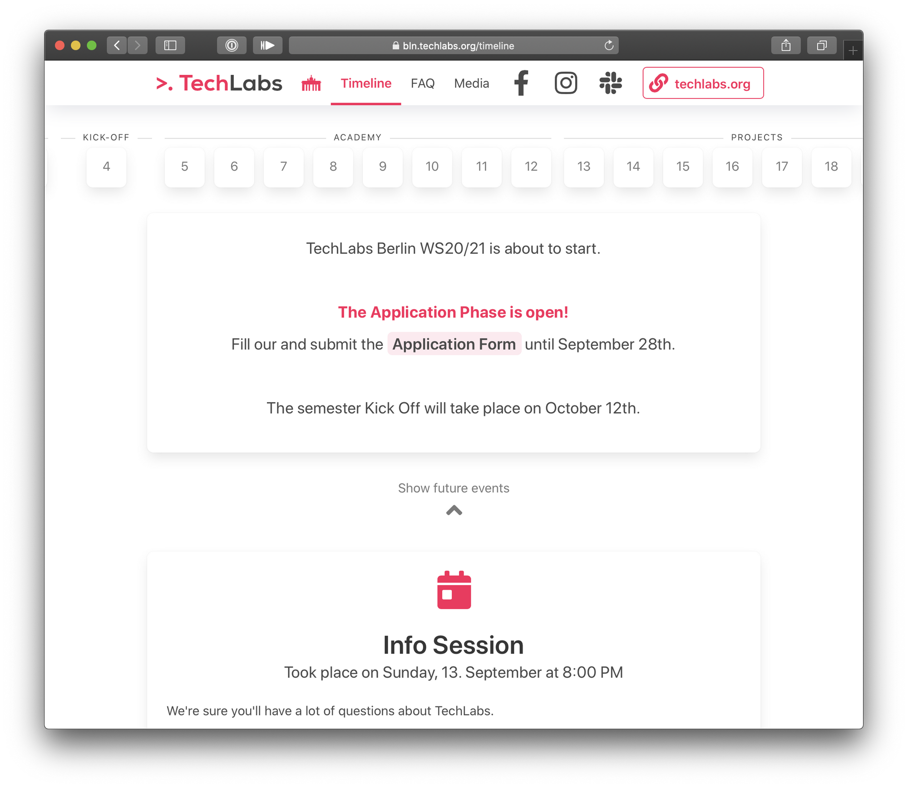

# TechLabs Semester Radar

> The TechLabs Berlin semester radar is a web app that provides our Techies with an overview of all the activities & milestones in their TechLabs   semester. On the Radar, they can see all the information they need at a glance.

## Resources

- [TechLabs Semester Radar Page ](https://bln.techlabs.org/timeline) 
- [Slack Channel](https://techlabs-community.slack.com/) 


## About Radar
> The Radar is built as a static single page app (SPA) with Nuxt.js using Vue.js as the frontend framework.
  For detailed explanation on how things work, check out [Nuxt.js docs](https://nuxtjs.org).

  


## Build Setup

```bash
# install dependencies
$ npm install

# serve with hot reload at localhost:3000
$ npm run dev

# build for production and launch server
$ npm run build
$ npm run start

# generate static project
$ npm run generate
```


## Contributing

We appreciate any contribution and are happy to get in touch. If you see a problem, 
please [open an issue](https://github.com/TechLabs-Berlin/radar/issues/new) in this repository. 
For write access to this repository, please send a message on our [Slack Channel](https://techlabs-community.slack.com/)

To contribute code, we use a Pull Request workflow:
1. Create a branch with your proposed changes and [open a Pull Request](https://github.com/TechLabs-Berlin/radar/compare)
2. We work with you for review and merge your code into the `main` branch.

## License

The `TechLabs-Berlin/radar` project is [licensed MIT](LICENSE.txt). Learn more about MIT license on [_choosealicense.com_](https://choosealicense.com/licenses/mit/).


